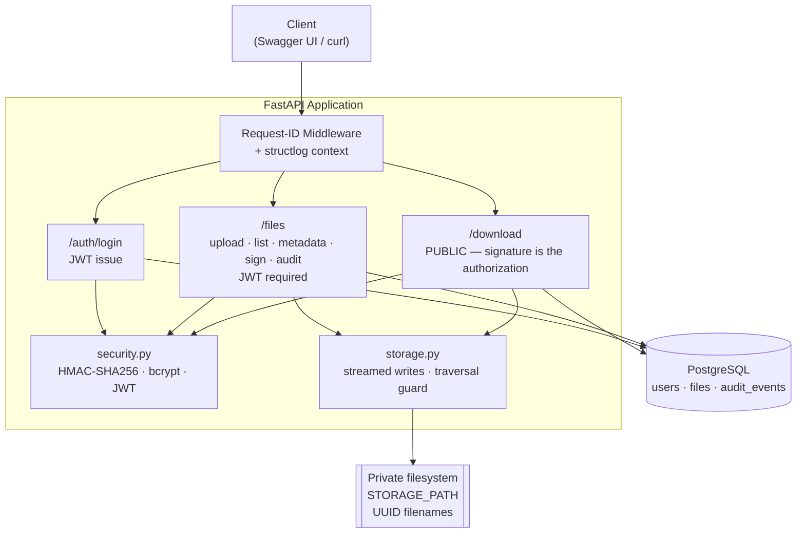
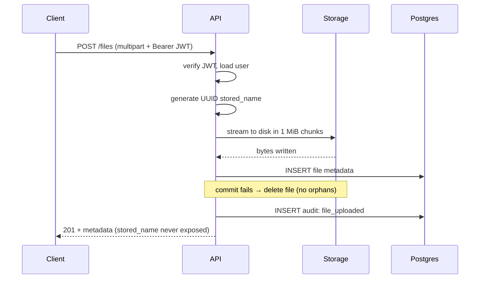
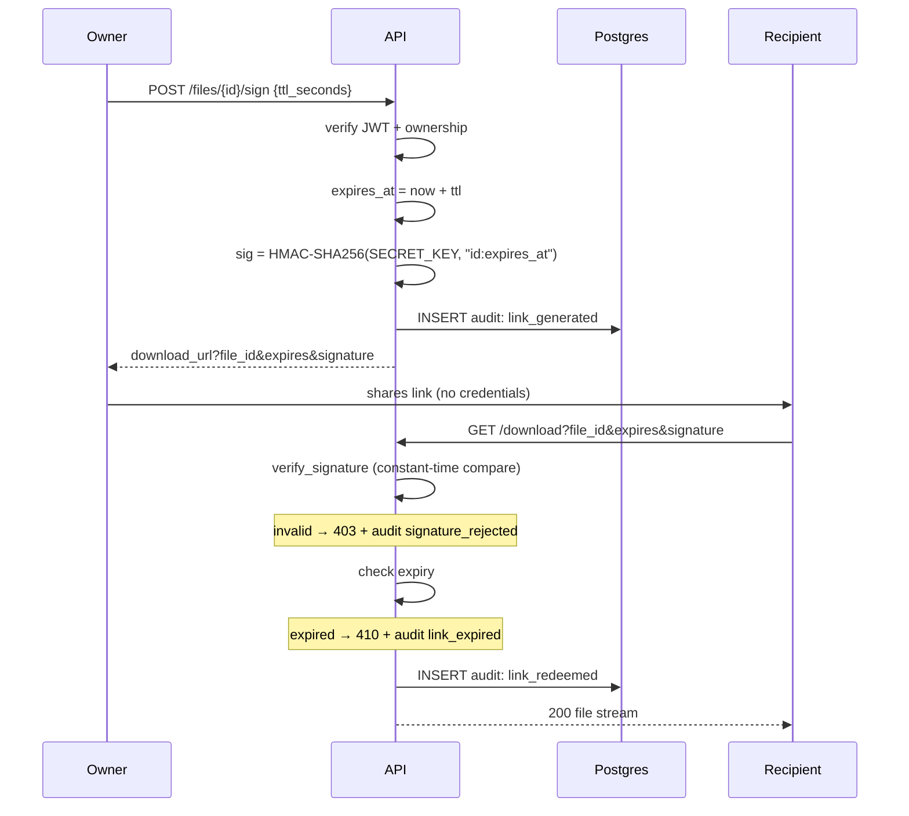

# Architecture — Secure File Sharing Service

## Component Overview

## Upload Flow

## Signing and Download Flow

## Key Design Decisions

| Decision | Rationale |
|---|---|
| **HMAC-SHA256 signing, not encryption** | The requirement is unforgeability, not confidentiality. File ID and expiry are public; the signature prevents tampering. |
| **Secret from environment, never generated at boot** | Links stay valid across restarts and redeploys, as required. |
| **`hmac.compare_digest`** | Constant-time comparison; `==` leaks how much of a guessed signature was correct via timing. |
| **Signature verified before any DB lookup** | Prevents using the endpoint to probe which file IDs exist. |
| **UUID filenames on disk** | Client filenames never touch the filesystem — eliminates path traversal. Original kept in DB for display. |
| **Metadata in Postgres, bytes on disk** | Matches the requirement; streams efficiently. Trade-off: two systems can drift, mitigated by rollback-and-delete. |
| **404 not 403 for unowned files** | A 403 confirms the file exists. 404 reveals nothing. |
| **410 expired vs 403 forged** | Semantically distinct: "was valid, now isn't" vs "never was". Separate audit events. |
| **Audit rows in Postgres *and* structured logs** | Logs are ephemeral and best-effort; audit is durable and queryable. Different guarantees. |
| **Request ID on every log line and error response** | Connects a user's report to a full server-side trace. |
| **Sync SQLAlchemy over async** | Workload is file-I/O bound; FastAPI's threadpool handles `def` handlers. Async adds failure modes for no gain at this scale. |

## Known Limitations / Next Steps

- **`create_all` instead of Alembic** — creates tables but cannot alter them; Alembic is the immediate next addition.
- **Local disk doesn't scale horizontally** — two instances behind a load balancer don't share a filesystem. Production path is object storage (DO Spaces / S3), where signed URLs map directly onto native capability.
- **No upload size limit** — should be capped at the reverse proxy and rejected before writing to disk.
- **JWTs cannot be revoked before expiry** — would need a token blocklist or short-lived tokens with refresh.
- **No rate limiting** on login or signing endpoints.
- **Tests run against SQLite** — query surface kept dialect-agnostic, but a Postgres service container in CI would close the gap.
